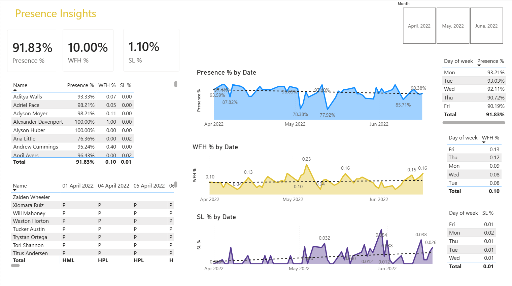
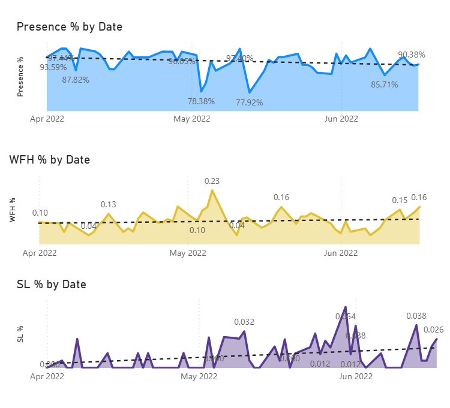

# HR Analytics Dashboard | Power BI Project

## Project Overview

This project is an interactive HR Analytics Dashboard built using Power BI and Excel to analyze employee attendance and workforce trends.
The dashboard helps HR teams monitor employee presence patterns, work-from-home trends, and sick leave behavior to support better workforce planning and decision-making.
This project was created as part of my learning journey in Data Analytics by following and implementing a real-world HR Analytics project inspired by the Codebasics Power BI series.

## Tools & Technologies Used

- Power BI
- Microsoft Excel
- Power Query
- DAX (Data Analysis Expressions)
- Data Cleaning
- Data Visualization

## Features of the Dashboard

- Employee attendance analysis
- Work From Home (WFH) trend tracking
- Sick leave percentage analysis
- Presence percentage KPIs
- Interactive filters and slicers
- Trend analysis by date and employee

## Key KPIs Tracked

- Presence %
- Work From Home %
- Sick Leave %
- Employee-wise attendance performance
- Day-wise attendance trends

## Dashboard Preview

### Main Dashboard

### Attendance Trend Analysis

## Key Insights

- Identified overall employee presence trends across different dates
- Analyzed work-from-home patterns among employees
- Tracked sick leave percentages to understand employee availability
- Created interactive visualizations for easier HR decision-making

## What I Learned

Through this project, I learned:

- Data cleaning and transformation using Power Query
- Creating calculated measures using DAX
- Building KPI cards and matrix visuals
- Creating interactive dashboards in Power BI
- Data visualization best practices
- Converting raw HR data into actionable business insights

## Future Improvements

- Add employee attrition analysis
- Add department-level insights
- Integrate SQL database connectivity
- Improve dashboard UI and storytelling

## Acknowledgements

This project is inspired by the HR Analytics Power BI project series by Codebasics.

YouTube Playlist:
https://www.youtube.com/playlist?list=PLeo1K3hjS3uuVQccZa7yFwK3ltoGQOWbM

